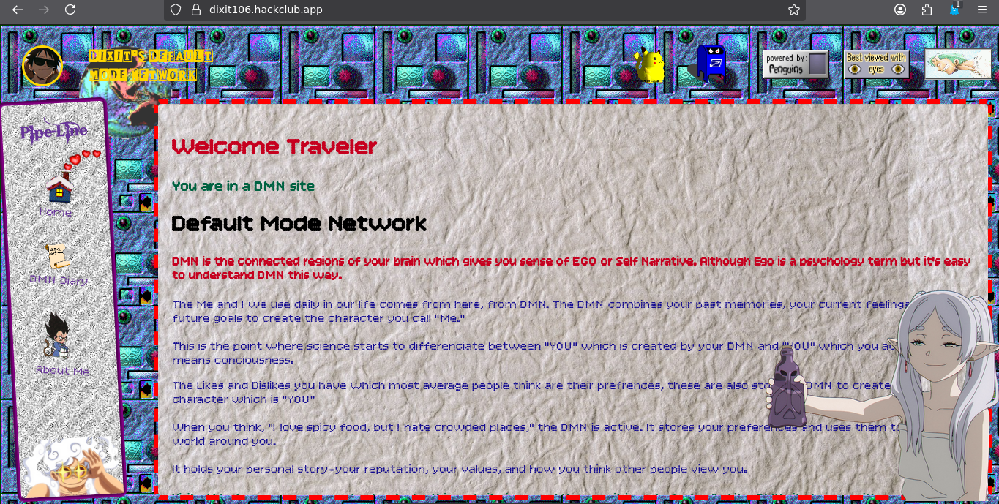
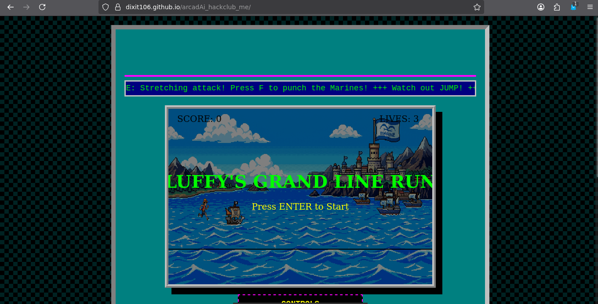
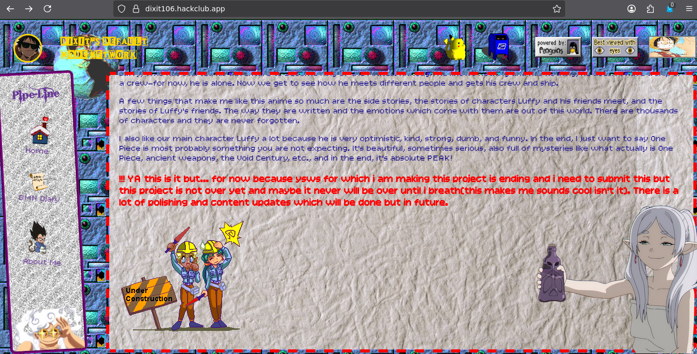

# Dixit's DMN


# What even is this website
**Dixit's DMN**, is a custom retro-themed personal digital shrine website built for the modern web but styled like the classic internet. 

I built this to be a part of the Web Revival movement, and this site is my small contribution to that community. The goal of web revival is to make the internet an interesting place again. It's about bringing back that feeling of mystery and endless discovery you first felt when you were new to the digital world.

The early internet was full of unique things to explore and learn. But slowly, the web has become highly corporate. Today, almost everything is locked behind a login screen. Most sites just want to harvest your data, track your habits, or sell you something.

Modern tech like Web3, AI, e-commerce, and the endless doomscrolling of social media is what the internet has largely become. The web revival movement actively opposes this shift. It's not that modern platforms are inherently evil—they absolutely have their uses and importance. The problem is that they are taking over the entire internet, pushing out individuality.

This site is a pushback against that. It doesn't track you, it doesn't sell you anything, and it doesn't ask you to log in. It is just a pure, creative, and independent corner of the web.


# Built With
**HTML**: For core structure and texts/images.

**CSS**: The fashion and clothes part for the website.

**Flask**: Backend part to connect stuff.

**Love**: Humans naturally have this but they keep forgetting its power as they grow.

**JS**: Very Very small amount of javascript for a cool feature(cursor animation)


# Images








# How to Contribute

The best way to contribute is simply by exploring the site! But if you want to help me improve it, I would love your feedback:

**Report Bugs:** Did you find a weird glitch, a broken link, or a layout issue? Let me know so I can fix it.

**Suggest Ideas:** Share your ideas for new features, hidden easter eggs, or cool retro web elements you would love to see added to the shrine.

**English Corrections:** I typed everything on this site myself, so there are probably a few spelling or grammar mistakes. If you spot any while reading, please point them out!

How to reach me:
You don't even need a GitHub account to contribute. Just use the Mail feature directly on the website to send me an email with your ideas, bug reports, or text corrections!

(If you are a developer, you are also welcome to open an Issue or a Pull Request right here on GitHub).


# Deployment

**Experience It Online**

Don't want to install anything or mess with code? No problem. You can explore the site directly in your browser!

Visit the Live Site: https://dixit106.hackclub.app/


**How to Run Locally**

Want to boot up this site on your own machine? It's super easy. You just need Python installed on your computer.

OPEN YOUR TERMINAL:-

1. Clone the repository:

```Bash
git clone git clone https://github.com/Dixit106/Dixit-s-DMN.git
```

2. Go into the folder:

```Bash
cd Dixit-s-DMN
```

3. Install Flask:
(Note: It is highly recommended to create a virtual environment first, but you can also just install it directly!)

```Bash
pip install flask
```

4. Start the server:

```Bash
python app.py
```
(Note: If your main python file is named something else, run that instead!)

5. Open your browser:
Go to http://127.0.0.1:5000 and start your journey!

